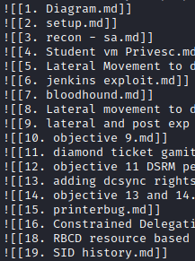
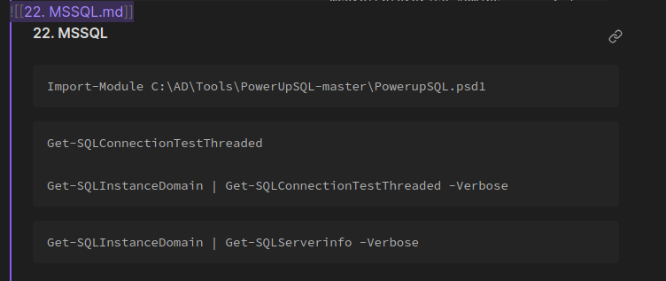
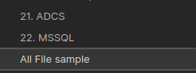
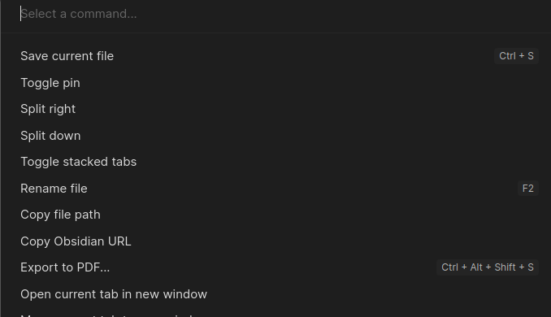
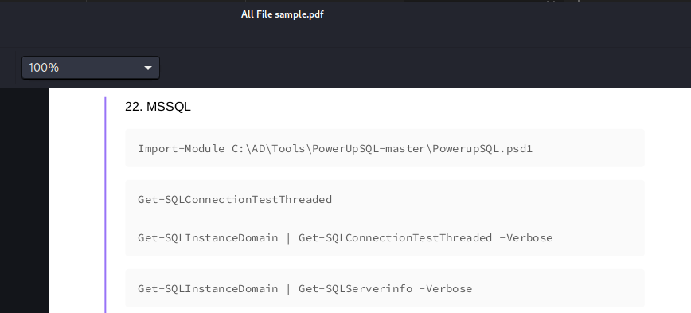

# compile-obsidian

> The script is used for creating an internal link on obsidian file with a markdown value of ![[1. File name here]]. It is suggested to use numerical value on the notes since the command is using sort -n. 

Just created this script to quickly compile all of the notes I created and export them into PDF.


Usage:

```
bash compile-obsidian.sh

Enter obsidian folder containing .md: /home/kali/Documents/notes/lab
```




### Exporting obsidian to pdf

* Copy all of the value created from the script.
* Create a new file and paste the value.




* Click the file.



* Click Open Command Palette and Export to PDF.



